<picture>
  <source media="(prefers-color-scheme: dark)" srcset="./assets/banner-motion-dark.svg">
  
</picture>

  <a href="./README.md">中文</a> &nbsp; / &nbsp; <strong>English</strong>

  <strong>Communication Engineering student · Embedded · Linux · Edge AI</strong> 
  From capturing a signal to making a task run reliably.

## 👋 Hi, I'm Caden

I'm a Communication Engineering student finding my way into computer systems. I started with microcontrollers and peripherals, then moved into multiprocess applications and edge inference on Linux. My curiosity has grown from getting a feature to work to understanding the scheduling, communication, and resource management underneath it.

I like following a problem one layer deeper. Where is the data waiting? Why does an old result arrive after cancellation? What happens to the rest of the system when a process exits? Embedded work made me attentive to timing, memory, and hardware constraints; now I want to understand the software side just as well.

🎯 **My main line right now is computer systems.** EE gave me an intuition for signals, timing, and hardware constraints; CS is where I want to put that back into the system view. I'm building up the foundations and testing what I learn through projects; longer term I'd like to work on GPUs and systems software.

## 🛠️ Projects · From boards to systems

These projects trace my path from peripherals and task scheduling to interprocess communication and task runtimes.

### [NexWeave](https://github.com/Caden-1224/nexweave)

🚧 <b>In development</b> &nbsp; / &nbsp; C++17 · Linux · ZeroMQ · CMake / CTest

A task framework for Linux edge devices. It brings session lifecycles, streaming data, cancellation, and backend integration under explicit execution contracts so models and devices can work together.

- **What I'm working through:** bounded buffering, cross-process cancellation, stale-result isolation, and cleanup when a task ends.
- **Current scope:** a Linux multiprocess pipeline validated with deterministic fake backends. Real models, audio devices, and RK3576 integration are not complete yet.

[Source](https://github.com/Caden-1224/nexweave) &nbsp; · &nbsp; [Status and roadmap](https://github.com/Caden-1224/nexweave#status)

### [VoxOrchestra](https://github.com/Caden-1224/voxorchestra-system)

✅ <b>Validated on hardware</b> &nbsp; / &nbsp; C++17 · TCP / ZeroMQ · RK3576 · Offline inference

An offline voice system validated on the RK3576-based Taishan Pi 3M, connecting **ASR → local retrieval / RAG → LLM → TTS** across multiple processes. Beyond the models, the work focuses on separate control and data planes, session orchestration, and failure boundaries.

- **What the repository records:** replaceable backends, protocol and deployment documentation, and 30 runs through the real hardware pipeline.
- **Current limits:** microphone capture uses a fixed duration; inference speed and cancellation responsiveness remain constrained by the backends.

[Source](https://github.com/Caden-1224/voxorchestra-system) &nbsp; · &nbsp; [Hardware validation](https://github.com/Caden-1224/voxorchestra-system/blob/main/docs/benchmark.md)

### [STM32 Polled Scheduler](https://github.com/Caden-1224/stm32-polled-scheduler)

📦 <b>Reusable template</b> &nbsp; / &nbsp; C · STM32F407 · HAL · Bare metal

A bare-metal template shaped by my microcontroller projects. Lightweight cooperative polling organizes periodic tasks, while **Core / Components / APP** layers separate peripheral drivers, reusable components, and application logic.

- **Practices included:** DMA, ring buffers, nonblocking state machines, and modules such as dual-axis SimpleFOC control.
- **Where it fits:** small embedded projects that need clear task organization and direct control of the hardware.

[Source and usage guide](https://github.com/Caden-1224/stm32-polled-scheduler)

## 📚 Learning · Connecting the foundations

| Area | Questions I want to understand |
| --- | --- |
| C++ and concurrency | Who owns a resource, how threads cooperate, and how cancellation and shutdown finish |
| Linux and operating systems | How processes, I/O, communication, and scheduling support applications |
| Architecture and performance | How data moves through memory and processors, and how to locate bottlenecks |
| GPUs and systems software | A longer-term direction to explore as those foundations grow |

I tend to start with a small runnable slice, then use tests, logs, and documentation to record what I learn. These repositories hold both the projects and the process of understanding them.

## 🧰 Tools I work with

<!-- Theme-aware SVG assets are stored in this repository. -->

<picture><source media="(prefers-color-scheme: dark)" srcset="./assets/chips/label-0-en-night.svg"></picture> <picture><source media="(prefers-color-scheme: dark)" srcset="./assets/chips/c-night.svg"></picture> <picture><source media="(prefers-color-scheme: dark)" srcset="./assets/chips/cplusplus-night.svg"></picture> <picture><source media="(prefers-color-scheme: dark)" srcset="./assets/chips/python-night.svg"></picture> <picture><source media="(prefers-color-scheme: dark)" srcset="./assets/chips/gnubash-night.svg"></picture> <picture><source media="(prefers-color-scheme: dark)" srcset="./assets/chips/linux-night.svg"></picture>
 
<picture><source media="(prefers-color-scheme: dark)" srcset="./assets/chips/label-1-en-night.svg"></picture> <picture><source media="(prefers-color-scheme: dark)" srcset="./assets/chips/stmicroelectronics-night.svg"></picture> <picture><source media="(prefers-color-scheme: dark)" srcset="./assets/chips/arm-night.svg"></picture> <picture><source media="(prefers-color-scheme: dark)" srcset="./assets/chips/rtos-night.svg"></picture> <picture><source media="(prefers-color-scheme: dark)" srcset="./assets/chips/bus-night.svg"></picture>
 
<picture><source media="(prefers-color-scheme: dark)" srcset="./assets/chips/label-2-en-night.svg"></picture> <picture><source media="(prefers-color-scheme: dark)" srcset="./assets/chips/cmake-night.svg"></picture> <picture><source media="(prefers-color-scheme: dark)" srcset="./assets/chips/zeromq-night.svg"></picture>
 
<picture><source media="(prefers-color-scheme: dark)" srcset="./assets/chips/label-3-en-night.svg"></picture> <picture><source media="(prefers-color-scheme: dark)" srcset="./assets/chips/git-night.svg"></picture> <picture><source media="(prefers-color-scheme: dark)" srcset="./assets/chips/docker-night.svg"></picture> <picture><source media="(prefers-color-scheme: dark)" srcset="./assets/chips/githubactions-night.svg"></picture> <picture><source media="(prefers-color-scheme: dark)" srcset="./assets/chips/claude-night.svg"></picture> <picture><source media="(prefers-color-scheme: dark)" srcset="./assets/chips/modelcontextprotocol-night.svg"></picture>

 
Also exploring:  <picture><source media="(prefers-color-scheme: dark)" srcset="./assets/chips/opencv-night.svg"></picture> <picture><source media="(prefers-color-scheme: dark)" srcset="./assets/chips/ros-night.svg"></picture>

 

<!-- ============ Sky ============ -->

  <picture>
    <source media="(prefers-color-scheme: dark)" srcset="./assets/sky-night.svg" />
    
  </picture>

## 📊 On the record

<!-- Public owned, non-fork repositories; refreshed by profile-assets.yml. -->

  <picture>
    <source media="(prefers-color-scheme: dark)" srcset="https://raw.githubusercontent.com/Caden-1224/Caden-1224/output/stats-dark.svg" />
    
  </picture>

Owned, public, non-fork repositories only. Scheduled every 10 minutes; the card shows its actual update time. <a href="https://github.com/Caden-1224/Caden-1224/actions/workflows/profile-assets.yml">View sync status</a>

<!-- Contribution animation is published independently from the stats card. -->

  <picture>
    <source media="(prefers-color-scheme: dark)" srcset="https://raw.githubusercontent.com/Caden-1224/Caden-1224/output/github-contribution-grid-snake-dark.svg" />
    
  </picture>

---

💬 If you're also learning about systems, tinkering with embedded hardware, or making your own move from EE to CS, feel free to say hi.

[Email](mailto:seekercaden@outlook.com) &nbsp; · &nbsp; [GitHub](https://github.com/Caden-1224)
