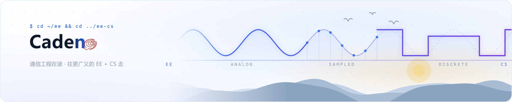

  

# Hi, I'm Caden 👋

**方向：底层系统 (Systems) · Infra**

我是 Caden，通信工程在读，正在从传统的 EE / 嵌入式，转向更广义的 EE + CS。这两者在很多学校本来就同属一个院系，共享同一套数学与物理底子，硬拆成两件事反而别扭。我想做的，是往下能碰到寄存器与时序、往上能处理并发与资源调度的那类活儿。

### 🛠 我的技术轨迹：从 KB 到 GB，从微秒到纳秒

- **起点：绝对稀缺的具体世界 (EE)**
  起点是单片机、外设和时序。在 RAM 以 KB 计、中断晚几微秒就是 bug、时序全靠翻数据手册的世界里，我学到最重要的一课：**计算从来不是免费的，资源永远是稀缺的。**

- **碰撞：用契约对抗复杂度 (CS)**
  往软件侧走，撞上的是"抽象"。进程、事件循环、状态机——CS 教我用接口和契约把复杂度关进黑盒。嵌入式的直觉让我总想"看清每一条指令"，CS 的工程思维教我"靠契约和测试兜底"。两种直觉经常打架，但也拼出了更完整的系统观。

- **融合：极大尺度下的算力压榨 (Systems & Infra)**
  再往上看，是显存带宽、kernel 访存模式、多卡通信开销。单片机上"内存不够、时序对不上"，和 GPU 上的"显存墙、算力权衡"，本质上是同一个问题。**嵌入式练的是在极小资源里把事情做成，Infra 练的是在极大资源里把资源用满。** 那种"贴着硬件思考"的直觉，是完全共通的。

### 🚀 近期探索

通信工程的底子在 AI 浪潮里正中靶心——分布式训练中，最贵的往往不是算力，而是通信。

- **[NexWeave](https://github.com/Caden-1224/nexweave)** — 边缘设备上的智能任务底座：用 C++17 把任务生命周期、流式数据与取消/恢复统一成一套契约，让不同模型和设备跑在同一套执行逻辑里。

### 🌱 目前状态

正在狂点 GPU、CUDA 和系统底层的技能树。诚实交代：GPU 那侧我还不算入门，正在补课中——但底层的硬件直觉已经就位，好戏才刚开始。

## 技术栈

**语言与系统**

**嵌入式**

**算法与工具**

**工程协作**

## 找到我

[seekercaden@outlook.com](mailto:seekercaden@outlook.com) · [@Caden-1224](https://github.com/Caden-1224)
